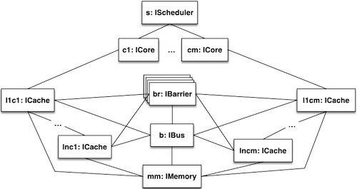

# ABS Model of a A Multicore Memory System

|  |
|:--:|
| <b>Figure 1</b>: System memory architecture |

A multicore memory system consists of cores that contain tasks to be executed,
the data layout in main memory (indicating where data is allocated), and a
system architecture consisting of cores with private multi-level caches and
shared memory (see Figure 1). Such a system is parametric in the number of
cores, the number and size of caches, and the associativity and replacement
policy.  Data is organised in blocks that move between the caches and the main
memory.  For simplicity, we abstract from the data content of the memory
blocks, assume that the size of cache lines and memory blocks in main memory
coincide and transfer memory blocks from the caches of one core to the caches
of another core via the main memory. As a consequence, the tasks executed in
the cores are represented as data access patterns, abstracting from their
computational content.
 
Task execution on a core requires memory blocks to be transferred from the
main memory to the closest cache.  Each cache has a pool of instructions to
move memory blocks among caches and between caches and main memory. Memory
blocks may exist in multiple copies in the memory system.  Consistency between
different copies of a memory block is ensured using the standard [cache
coherence protocol MSI](https://en.wikipedia.org/wiki/MSI_protocol), with
which a cache line can be either modified, shared or invalid.  A modified
cache line has the most recent value of the memory block, therefore all other
copies are invalid (including the one in main memory). A shared cache line
indicates that all copies of the block are consistent.  The protocol's
messages are broadcasted to the cores.  Following standard nomenclature, `Rd`
messages request read access and `RdX` messages read exclusive access to a
memory block. The latter invalidates other copies of the same block in other
caches to provide write access.

|  |
|:--:|
| <b>Figure 2</b>: ABS model structure |


This use-case contains a distributed implementation of this model in ABS (see
Figure 2). A transition system specification of this model can be found at
https://doi.org/10.1016/j.scico.2019.04.003

We have two versions of the model which can run with different initial
configurations:

- `withoutPenaltiesSimplified`:  no collection of penalties
- `withPenaltiesSimplified`: collection of hits and penalties. Hits count the
  number of times a memory block was found in the caches.  Penalties vary
  (from 1,10, 100, etc.) depending from where in the memory system the memory
  block was accessed.  The further down the data is accessed in the memory
  system, the higher the penalty.

## Model configurations

All the configurations have 4 cores with three levels of caches,
but they are varying in the number, size and access patterns of the tasks.

- **Config1**: 

  Contains 10 tasks with 100 read/write instructions each.  It has one access
  per memory block, where all the tasks do not share any block during
  execution.

- **Config2**: 

  Contains 10 tasks with 100 read/write instructions each.  Tasks interleaves
  between a read and a write with one access per memory block.  Each task
  shares with the next task 1/4 of its blocks.

- **Config3**: 

  Contains 10 tasks with 100 read/write instructions each.  Task interleaves
  between a read and a write to the same memory block, therefore each task has
  two accesses read/write per memory block.  All the tasks do not share any
  block between them during execution.

- **Config4**: 

  Contains 10 identical tasks with a loop accessing one memory block many
  times. Since all the cores access a single memory block many times, the
  execution generates congestion.

## Running the simulation with penalties

```
absc --erlang common/*.abs  withPenalties/*.abs  configs/ConfigX.abs
./gen/erl/run
```

Where `X` correspond to which initial configuration is chosen.

Example output of running **Config4**:

```
C1: hits = 10; penalties = 120
C2: hits = 10; penalties = 1220
C3: hits = 10; penalties = 2210
C4: hits = 10; penalties = 3090
```

## Running the simulation without penalties

```
absc --erlang common/*.abs  withoutPenalties/*.abs  configs/ConfigX.abs
./gen/erl/run
```

Example output of running **Config1**:

```
Execution has terminated
```
